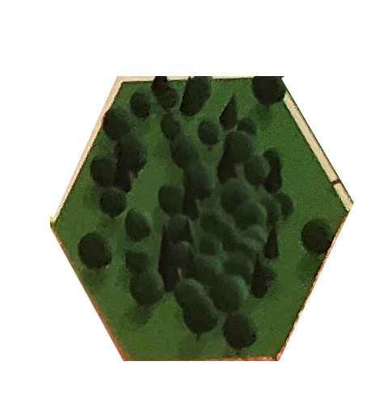
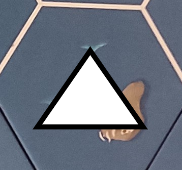
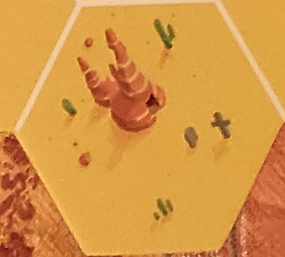
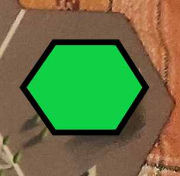
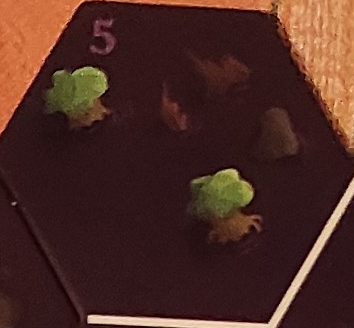
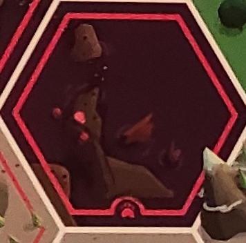
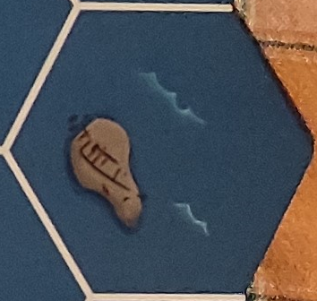
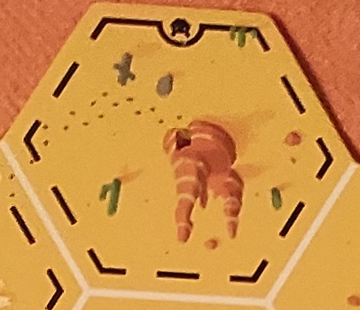
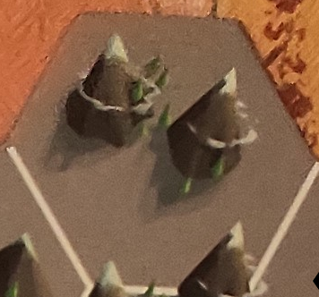
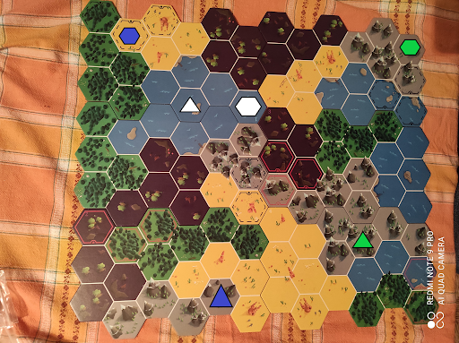

# Cryptid Challenge

This challenge is based over a table game i've played some time ago.
Here the details of the game with the requirements to meet the challenge

## Game rules

In this game you need to find the tile where the beast Cryptid lives (hence the name of the challenge)

There is a map composed by different hexagonal tiles

Each tile can be:
- a desert
- a forest
- a mountain
- a lake
- a marsh

some of the tile can also have

- a bear
- a puma

Each player are given a clue that gives you some information where cryptid could be, but these information are not enough, you need to fetch information from other players

## start of the game

For the first 2 rounds each player needs to place a colored cube in a tile that does not match with his clue

## turn phase - a player can choose to

- ask the “could the cryptid live here?”) question + pointing a tile → to only one other player, and based on his clue he will 

    - place a disc made by his color if the answer is “yes”
    - place a cube where it is not possible to find the beast  AND in this case also the player that asked the question needs to put down a cube

- or can ask to every player the same question, by placing his disc (meaning how many other can confirm my supposition)

  - now in turn, each player place a disc or a cube and when a cube is placed this process ends otherwise the player that asked the question WINS if a tile will contain all the discs

## Possible clues that each player can receive

- In 2 type of terrain
  - In desert or lake
  - In desert or forest
  - In desert or marsh
  - In desert or mountain
  - In lake or mountain
  - In lake or forest
  - In lake or marsh
  - In mountain or forest
  - In mountain or marsh
  - In marsh or forest
- On or 1 tile near a terrain or an animal
  - On or near 1 tile of a desert
  - On or near 1 tile of a lake
  - On or near 1 tile of a mountain
  - On or near 1 tile of a marsh
  - On or near 1 tile of a forest
  - On or near 1 tile of a an animal (puma or bear)
- On or 2 tiles near a tower, or cabin abandoned
  - on or near 2 tiles of a cabin abandoned
  - on or near 2 tiles of a rock (hexagon)
  - on or near 2 tiles of a puma
  - on or near 2 tiles of a bear
- On or 3 tiles near a structure
  - On or 3 tiles near a white structure
  - On or 3 tiles near a black structure
  - On or 3 tiles near a blue structure
  - On or 3 tiles near a green structure

## Terrains

|terrain|picture|terrain|picture|
|-------|-------|-------|-------|
|forest|  |cabin|  |
|desert|  |rock|  |
|marsh|  |puma (red border)|  |
|lake|  |bear (black border)|  |
|mountain|  |

## Map

## Initial Clues for 4 players

|player|clue|color of pieces|
|------|----|-----|
|A (alfa)|In a Lake or Mountain|red|
|B (beta)|Inside or near 2 tiles from a bear territory|green|
|E (eta)|Inside or near 1 tile from a forest|blue|
|G (gamma)|Inside or near 2 tiles from an abandoned cabin|orange|
|Y (epsilon)| not playing|purple|

12 or more cubes for each player

10 or more discs for each player

The composition of all the clues will give you the exact location of cryptid, but the challenge is to simulate a real game and get to the solution as soon as possible

You can choose whatever player you will be. 
(in a real game you will not have access to the whole clues, of course my dear)

# Challenge

Write an algorithm, a small demo, a prototype, whatever in your favorite programming language that will find find where the creature lives ( one exact tile) in the earliest turn possible.

Note that in each game the order of clues that other players 
give you by placing a disc or a cube in the map could be different

## Simulation

setup phase, where each player have to put down two cubes

|description|image|
|------|----|
|Initial map with cabin and rock placed| |
|player A put a red cube| |
|player B put a green cube| |
|player E put a blue cube| |
|player G put a orange cube| |
|player A put a red cube| |
|player B put a green cube| |
|player E put a blue cube| |
|player G put a orange cube| |

Mid phase, where player ask questions each other

|question|answer|in case answer is negative |
|------|----|----|
|Player A asks player B: Could it be here (where the star is)?  | since the Beast can be inside 2 tiles near it’s inside, player B put a disc |
|Player B asks player C: Could it be here (where the star is)?  | the answer is negative so player C put a cube | also player B needs to put a cube  |

The beast is HERE

 